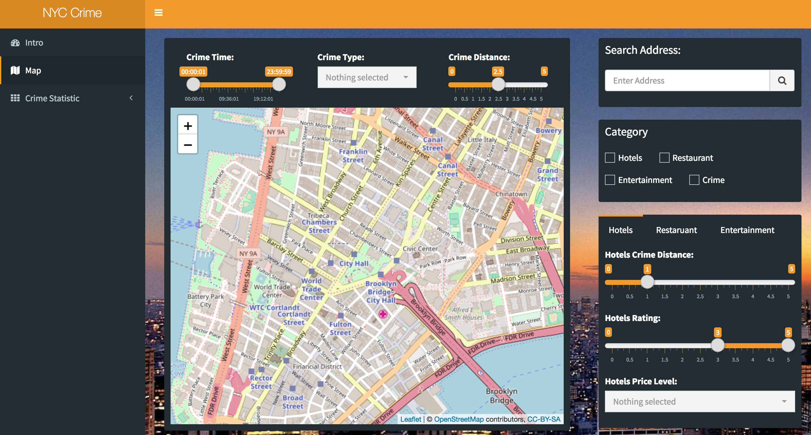

# Project 2: Tourists Guide in New York City

Term: Fall 2018

In this second project of GU4243/GR5243 Applied Data Science, we develop an *New York City Tourist Guide and Crime* shiny app which give tourists some guide about how to live and play safe in New York City.

+ **Team 10 - Team Members:**
	+ Zhongce Ji (zj2225)
	+ Yan Wang (yw3177)
	+ Yaxin Wang (yw3042)
	+ Chun Zhai (cz2466)
	+ Kehui Zhu (kz2293)
	
+ **Link to deployed Shiny-App:**
https://fall18sec2proj2grp10.shinyapps.io/New_York_Crime/


## Introduction:

In this second project, we have developed an Rshiny application designed to help people who want to visit the New York City and the application will show you the place that you can live or enjoy life safely. 




## Project summary
When people plan to visit the New York City, they will take many factors into consideration when they are looking for some place to live or to eat. And the safety is one of the most important factor which many people will use to eveluate whether the place is a great choice or not. 

In the intro tab, you can search any place you want to live or go, then it will lead you to the second tab which is a map tab, in the tab you can find where you are and marker of current position will show the crime level at your place such as the crying face means there are many crime happend before around and you should be careful, the love face means there are just a few crime happened before around you so you can be relax. Then you can user crime check box to see where the crime happened before and you can use selection to see the crime level at your location according to different type, time and the distance between you and crime. Then you also can use category checkbox to show the around Hotels, Restaurant and Enteritainment, which also will be marked according to the crime level around those category. But also you can change parameter such as distance between crime and hotels to adjust the crime that you care about to find out safe place to live.

In the statistic tab, you can find some bar chart or pie chart which analyze the cirme in New York City according to its type, victims, time and many other factors. The visualization analysis give you a great idea about the crime in the New York City which you can use to make decisions such as where to live, when you go out, the time you need to go back to hotel at the latest.

+ **Data Source**: We used data from data.gov, New York Open Data and yelp. We use yelp API to get real time category data, and Google API to get geo information about the locations. 


+ **Contribution statement**: All team members contributed equally in all stages of this project. All team members approve our work presented in this GitHub repository including this contributions statement. 

    + Map : Zhongce Ji ( zj2225 ), Yan Wang ( yw3177 ), Yaxin Wang ( yw3042 )
    + Statistics : Chun Zhai (cz2466), Kehui Zhu (kz2293)
    + Special: Special Credit to **Minmin Zhu** who give us the idea about tourists, also help design UI and selection for Icon in the UI part.
      
Following [suggestions](http://nicercode.github.io/blog/2013-04-05-projects/) by [RICH FITZJOHN](http://nicercode.github.io/about/#Team) (@richfitz). This folder is orgarnized as follows.

```
proj/
├── app/
├── lib/
├── data/
├── doc/
└── output/
```

Please see each subfolder for a README file.

